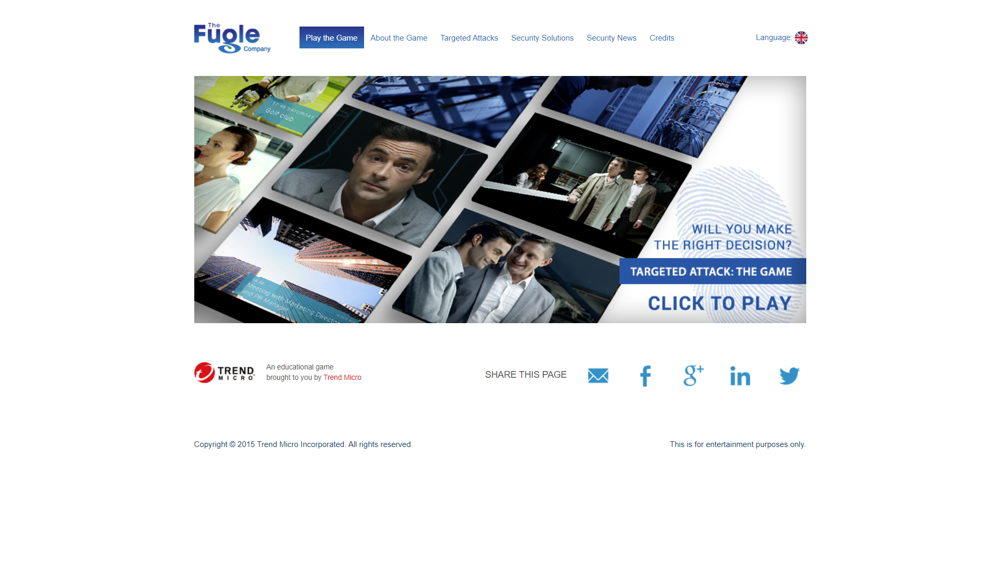
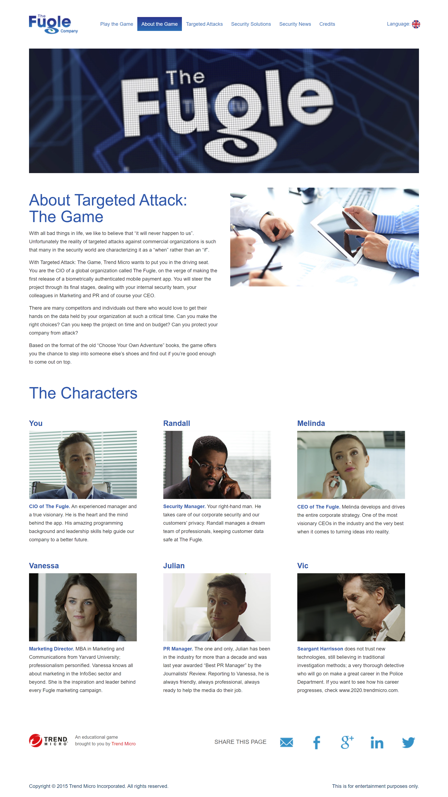

# TM Targeted Attack: The Game

An analysis and renpy port of the 2015 interactive web story choice game, [Targeted Attack: The Game](http://targetedattacks.trendmicro.com/) by Trend Micro

## About the Game

You take on the role as a CIO of a company that is releasing their new app. You must make choices to help protect the company while being mindful of your budget. Can you make the right choices?

## Want to Get All the Endings?

This repository also includes a detailed analysis and mapped out flowchart of the games choices. The game flow has also been implimented in the python visual novel engine [Ren'Py](https://www.renpy.org/). Spoilers Ahead!

## Why?

This fun game has often been used as an interactive classroom activity or teaching tool but as of the end of 2023/start of 2024, the game has been taken down for unknown reasons. This is just speculation but it may be due to the new 2021 [Data Center Attack: The Game](http://datacenterattacks.trendmicro.com/). You can check out the new game here:

https://resources.trendmicro.com/datacenter-attack.html

> [!WARNING]
> The section below contains spoilers for the game's storyline

    
<strong>SPOILER WARNING</strong>

## Game Flowchart

Flowchart created using https://app.diagrams.net aka drawio

The flowchart's xml .drawio file is also included in this repository

#### How to Read the Flowchart

- Start from top, end at bottom
- CH = Chapter (1 - 5)
- Arrows point in the direction of the story flow
- Numbers on the line determine the cost of the choice (start with 6)
- Sometimes dotted lines are used, this is for readability purposes because some choices do take you backwards or are just not visible due to previous choices
- The various choice recaps correspond to their colour coded choice

## Game Flow

- There are 3 bad endings and 1 good ending not counting the recap on choices
- The game has 5 chapters in total plus an extra after story recap choices section (recap only if bad ending)
- The start of the new chapter is the chapter intro
- The videos are categorised from A to C and from 1 to 3 based on the 3 different routes a choice can take with the additon of alternate routes in some cases
- There are only 3 places where the choices actually matter and have impact on the outcome, in Chapter 2, Chapter 4 and Chapter 5 (renpy flags)
- In the original game in chapter 3, if one of the win conditons was chosen, the videos in chapter 3 will have "_W" appended to it in the file name until chapter 4 otherwise the appended videos and non-appended videos are identical. I can only guess that it was being used as a flag.
- At times, such as the first choice screen in Chapter 4, the choice screen showed the overlay for the display of the remaining budget but it is not shown. All choices after chapter 2 do not have costs. Maybe the choices here was supposed to require use of the budget?

#### Win Conditons
1. Chapter 2
Invest in Breach Detection technology. - 2
2. Chapter 4
Have the Security team check the Breach Detection System logs (only visible if Invest in Breach Detection technology was chosen in Chapter 3)

## Setup of Renpy project

1. Download the project files into your renpy project directory (renpy 8.2.0.24012702)
2. Download the game media files, extract
3. Verify files (optional)
4. With the game media files ([renpy movie video support](https://www.renpy.org/doc/html/movie.html) - VP9 WebM 720p 1000kbps avg, burned EN subs) place it into the game directory folder
5. In the renpy launcher Check Script with Lint (optional not needed if no changes)
6. In renpy launcher - Build Distributions (if you want to build)

or

6. Just Launch Project from the Launcher

## Media files

Metadata not encrypted

Original Video + EN srt subs: https://small.fileditchstuff.me/s6/ttmbdMEvUCKMigkJSET.7z

SHA-256: `32B66B1F4EC4FFED18B5AAD85D34E4A7EE19B4D1FACAEEA4197F3B9B86F27ED4`

password: `Fd£4mC2{nO1r`

---

Renpy Game Media Files: https://small.fileditchstuff.me/s6/YWABocoTwGyOmwSCFAvp.7z

SHA-256: `32BB84D4452FC2B485827D3ACA10BA573776A70C8673057F470F754E2EF72AA5`

password: `"doZP[71F66V`

## FAQ

#### Where and how can I play the game?

You can play the game at the link here: http://targetedattacks.trendmicro.com/

#### Why does the link not work? Why can't I play the game?

As of the end of 2023/start of 2024, the game has been taken down and cannot be played through the website, this is when I created a renpy port of the game flow

#### How do I setup/install renpy?

I recommend looking through the renpy documentation. Even if you are not modifiying anything and just trying to setup and create a build, at least taking a quick look at the quickstart guide will answer most of your questions

https://www.renpy.org/doc/html/quickstart.html

#### What do I do with the md5 hash and .md5 file?

Both md5 hash and .md5 file is used to verify the integrity the download, optional but recomended practice

#### What changes did you make to the renpy project as compared to the original?

More or less the default renpy starter default template, just created the story flow, budget and cost choice system. One minor difference is that in the original, only when when the choices have costs it will display the remaining budget otherwise no, but in this renpy version at all decisions the remaining budget is shown. Might have someting special for the endings though ;)

#### Notice

This project is in no way affiliated, associated, authorised, endorsed or officially connected with Trend Micro

## Links
- [Game](http://targetedattacks.trendmicro.com/)
- [Game Main Page](http://targetedattacks.trendmicro.com/index.html)
- [Game About](http://targetedattacks.trendmicro.com/about-the-game.html)
- [Game Credits](http://targetedattacks.trendmicro.com/credits.html)
- [Game Trailer](https://www.youtube.com/watch?v=uN8cDjEPuZc)
- [Media Post](https://www.trendmicro.com/vinfo/br/security/news/cyber-attacks/play-cio-in-targeted-attack-game)
- [Targeted Attack Resources](https://resources.trendmicro.com/cyberattacks)

### Others
- [Playthrough by bytefreaks](https://bytefreaks.net/howtos/the-fugle-company-the-optimal-solution)
- [Playthrough by bytefreaks Video](https://www.youtube.com/watch?v=2gmUhB-6bZQ)
- [University of Rizal System Writeup](https://www.studocu.com/ph/document/university-of-rizal-system/information-assurance-and-security/case-study-targeted-attack-game/40392723)
- [Westwood High School Writeup](https://www.coursehero.com/file/90015170/Copy-of-Targeted-Attack-The-Game/)
